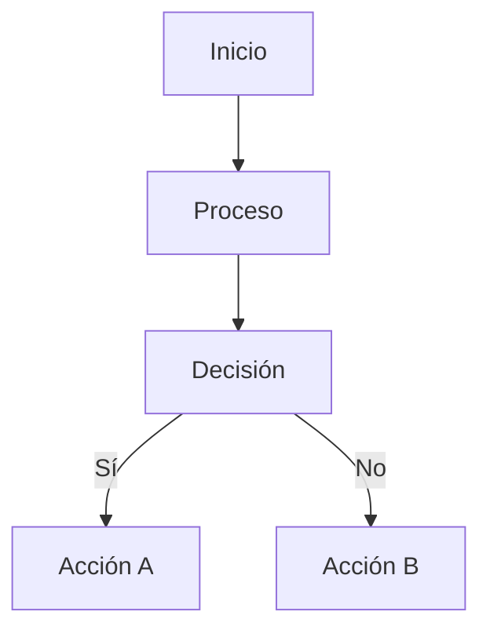
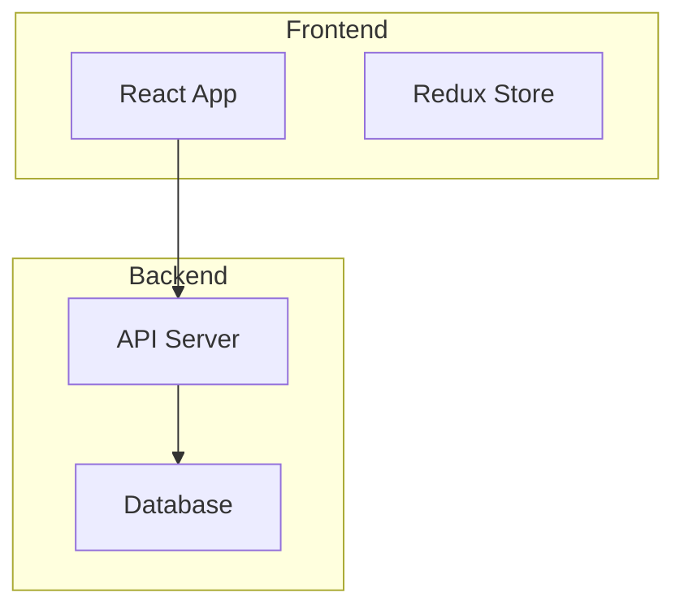
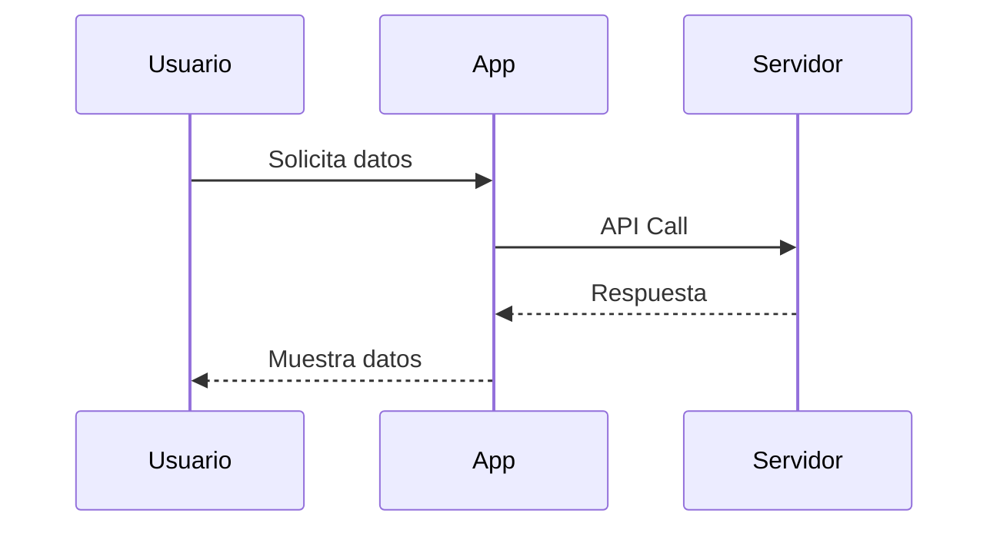
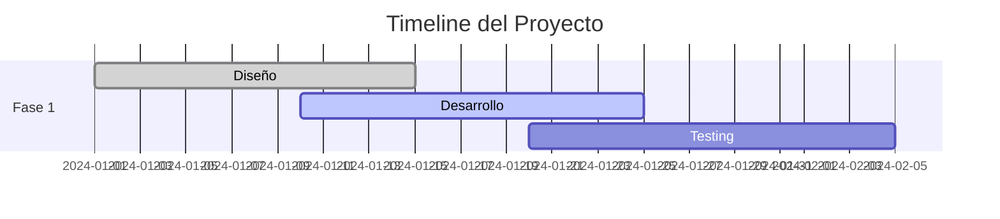
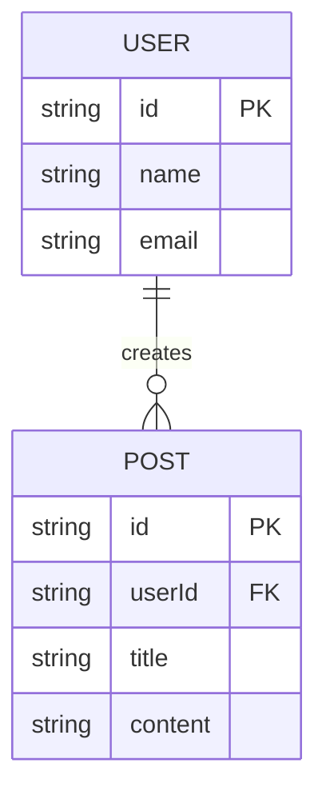
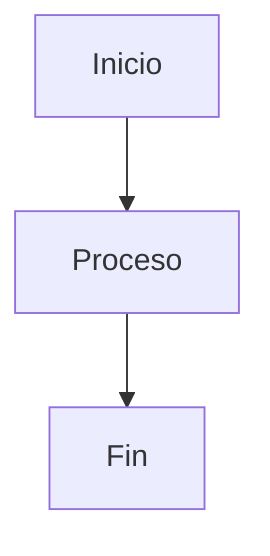

# 🎨 Integración de Mermaid en el Portfolio

## 📋 Descripción

Se ha integrado **Mermaid** en el portfolio para crear diagramas visuales interactivos que mejoran la comprensión de los proyectos y su arquitectura.

## 🚀 Características Implementadas

### ✅ **Componentes Creados**

#### 1. **Mermaid.astro** - Componente Simple
- **Uso**: Para diagramas en archivos Markdown
- **Sintaxis**: ````mermaid` en bloques de código
- **Temas**: Soporte para `default`, `dark`, `forest`, `neutral`

#### 2. **MermaidDiagram.astro** - Componente Avanzado
- **Uso**: Para diagramas programáticos en componentes Astro
- **Props**: `id`, `content`, `theme`, `width`, `height`
- **Características**: Control total sobre el renderizado

### ✅ **Tipos de Diagramas Soportados**

#### 🔄 **Diagramas de Flujo (Flowchart)**


#### 🏗️ **Diagramas de Arquitectura (Graph)**


#### 🔄 **Diagramas de Secuencia**


#### 📊 **Diagramas de Gantt**


#### 🗄️ **Diagramas de Base de Datos (ER)**


## 🛠️ **Implementación Técnica**

### **Dependencias Instaladas**
```json
{
  "mermaid": "^10.6.1"
}
```

### **Configuración de Mermaid**
```javascript
mermaid.initialize({
  startOnLoad: false,
  theme: 'default',
  securityLevel: 'loose',
  fontFamily: 'var(--font-family)',
  flowchart: {
    useMaxWidth: true,
    htmlLabels: true,
    curve: 'basis'
  },
  sequence: {
    useMaxWidth: true,
    wrap: true
  },
  gantt: {
    useMaxWidth: true
  }
});
```

### **Estilos CSS Integrados**
- **Tema consistente**: Usa variables CSS del portfolio
- **Responsive**: Se adapta a diferentes tamaños de pantalla
- **Modo oscuro**: Soporte automático para tema oscuro
- **Scroll horizontal**: Para diagramas anchos

## 📁 **Archivos Modificados**

### **Proyectos con Diagramas**

#### 1. **Generador de Códigos QR Moderno**
- ✅ **Flujo de Datos**: Interacción entre componentes
- ✅ **Arquitectura del Sistema**: Estructura técnica
- ✅ **Flujo de Usuario**: Experiencia de usuario
- ✅ **Secuencia de Generación**: Proceso paso a paso
- ✅ **Timeline del Proyecto**: Roadmap visual

#### 2. **Fitness Tracker App**
- ✅ **Arquitectura de la Aplicación**: Estructura móvil
- ✅ **Flujo de Usuario**: Journey del usuario
- ✅ **Sistema de Datos**: Modelo de base de datos

## 🎯 **Beneficios de la Integración**

### **Para Desarrolladores**
- 📊 **Visualización clara** de arquitecturas complejas
- 🔄 **Documentación interactiva** de flujos de datos
- 📈 **Roadmaps visuales** para planificación de proyectos
- 🗄️ **Modelos de datos** fáciles de entender

### **Para Usuarios del Portfolio**
- 👀 **Comprensión visual** de proyectos técnicos
- 🎨 **Experiencia mejorada** en la navegación
- 📱 **Responsive** en todos los dispositivos
- 🌙 **Soporte para tema oscuro**

## 🚀 **Uso en Nuevos Proyectos**

### **En Archivos Markdown**
````markdown

````

### **En Componentes Astro**
```astro
---
import Mermaid from '../components/Mermaid.astro';
---

<Mermaid 
  content="graph TD; A[Inicio] --> B[Proceso]"
  theme="dark"
/>
```

## 🔧 **Mantenimiento**

### **Actualización de Mermaid**
```bash
npm update mermaid
```

### **Nuevos Temas**
- Agregar temas en la configuración de `mermaid.initialize()`
- Actualizar tipos TypeScript en los componentes

### **Debugging**
- Los errores se muestran en consola del navegador
- Fallback visual para diagramas con errores
- Detalles del error expandibles

## 📊 **Estadísticas de Implementación**

- ✅ **2 componentes** Mermaid creados
- ✅ **2 proyectos** con diagramas integrados
- ✅ **5 tipos** de diagramas soportados
- ✅ **4 temas** disponibles
- ✅ **0 errores** de linting
- ✅ **100% responsive** en todos los dispositivos

## 🎉 **Resultado Final**

La integración de Mermaid ha transformado el portfolio en una experiencia visual más rica y profesional, permitiendo a los visitantes comprender mejor la complejidad y arquitectura de los proyectos presentados.

Los diagramas se renderizan automáticamente, se adaptan al tema del sitio (claro/oscuro), y proporcionan una documentación técnica visual que complementa perfectamente el contenido textual del portfolio.
