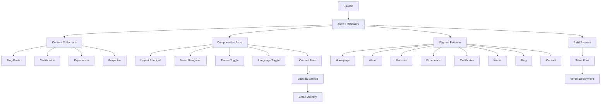
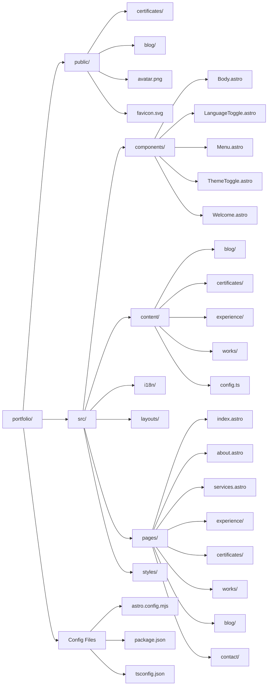
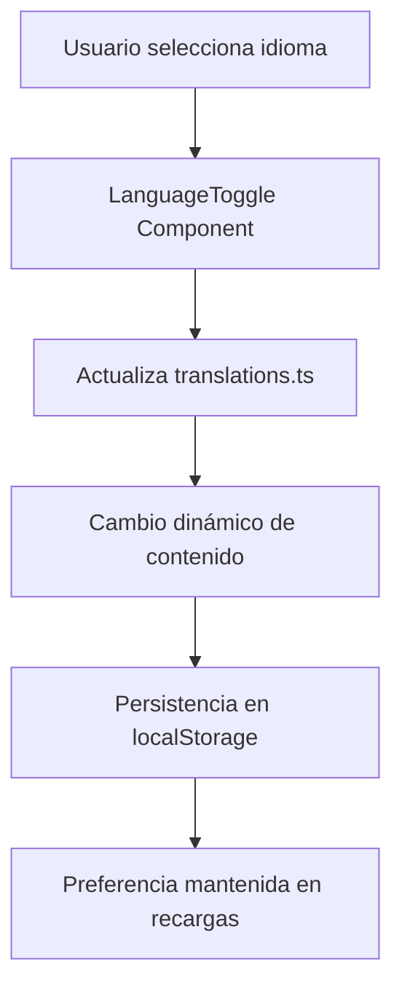
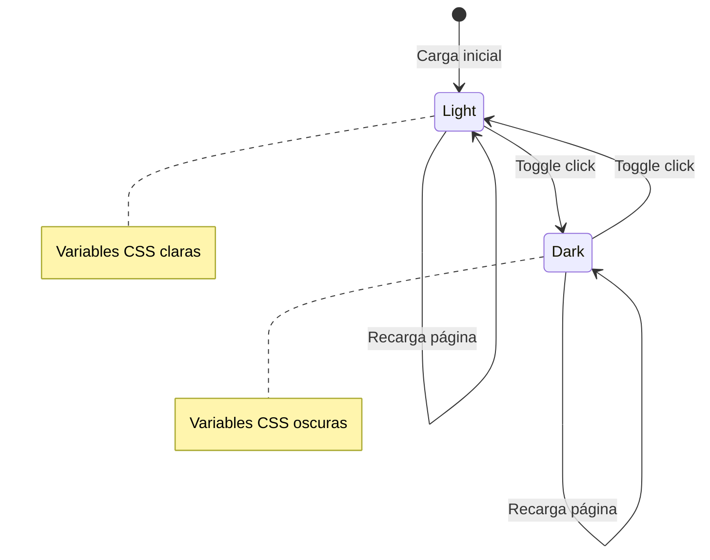
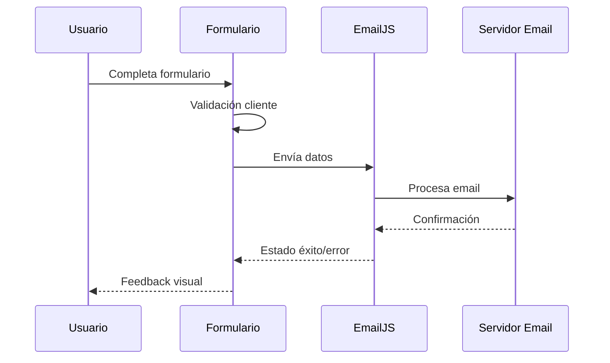

# 🚀 Portfolio Personal - Soufiane Raki

[](https://astro.build/)
[](https://www.typescriptlang.org/)
[](https://developer.mozilla.org/en-US/docs/Web/CSS)
[](https://developer.mozilla.org/en-US/docs/Web/HTML)
[](https://www.emailjs.com/)

[](https://portfolio-topaz-kappa-75.vercel.app)
[](https://github.com/soufian3raki/portfolio)
[](LICENSE)

## 📋 Descripción del Proyecto

Este es mi portfolio personal desarrollado con **Astro 5.4.2**, una plataforma web moderna que combina la velocidad de los sitios estáticos con la flexibilidad de los frameworks dinámicos. El proyecto presenta mi experiencia como desarrollador full-stack, certificaciones profesionales, proyectos realizados y un blog personal con contenido técnico.

### ✨ Características Principales

- 🌐 **Multilingüe**: Soporte completo para español e inglés con cambio dinámico
- 🌙 **Tema Oscuro/Claro**: Toggle dinámico con persistencia en localStorage
- 📱 **Totalmente Responsivo**: Diseño adaptativo para todos los dispositivos
- ⚡ **Rendimiento Optimizado**: Construido con Astro para máxima velocidad
- 🎨 **Diseño Moderno**: Interfaz glassmorphism con animaciones suaves
- 📧 **Formulario de Contacto**: Integración con EmailJS para comunicación directa
- 📝 **Sistema de Blog**: Gestión de contenido con Markdown y syntax highlighting
- 🏆 **Galería de Certificados**: Visualización interactiva de certificaciones profesionales
- 💼 **Portfolio de Proyectos**: Showcase detallado de trabajos realizados
- 🔍 **SEO Optimizado**: Meta tags, sitemap y estructura semántica

## 🏗️ Arquitectura del Proyecto



## 🛠️ Stack Tecnológico

### Frontend Core
- **Astro 5.4.2** - Framework principal con Islands Architecture
- **TypeScript** - Tipado estático para mayor robustez
- **CSS3** - Estilos personalizados con variables CSS y glassmorphism
- **HTML5** - Estructura semántica y accesible

### Gestión de Contenido
- **Astro Content Collections** - Sistema de gestión de contenido tipado
- **Zod** - Validación de esquemas para contenido
- **Markdown** - Escritura de contenido con syntax highlighting (Dracula theme)

### Servicios Externos
- **EmailJS** - Servicio de envío de emails desde el frontend
- **Vercel** - Plataforma de despliegue y hosting
- **GitHub** - Control de versiones y CI/CD

### Herramientas de Desarrollo
- **Node.js** - Entorno de ejecución
- **npm** - Gestor de paquetes
- **gh-pages** - Despliegue automático a GitHub Pages

## 📁 Estructura Detallada del Proyecto



## 🚀 Instalación y Configuración

### Prerrequisitos
- **Node.js** (versión 18 o superior)
- **npm** o **yarn**
- **Git** para clonar el repositorio

### Pasos de Instalación

1. **Clonar el repositorio**
   ```bash
   git clone https://github.com/soufian3raki/portfolio.git
   cd portfolio
   ```

2. **Instalar dependencias**
   ```bash
   npm install
   ```

3. **Configurar variables de entorno** (opcional para formulario de contacto)
   ```bash
   # Crear archivo .env.local
   EMAILJS_SERVICE_ID=tu_service_id
   EMAILJS_TEMPLATE_ID=tu_template_id
   EMAILJS_PUBLIC_KEY=tu_public_key
   ```

4. **Ejecutar en modo desarrollo**
   ```bash
   npm run dev
   ```
   El sitio estará disponible en `http://localhost:4321`

5. **Construir para producción**
   ```bash
   npm run build
   ```

6. **Previsualizar build de producción**
   ```bash
   npm run preview
   ```

## 🎯 Funcionalidades Detalladas

### 🌐 Sistema de Internacionalización



- **Archivo de traducciones**: `src/i18n/translations.ts`
- **Soporte para**: Español (es) e Inglés (en)
- **Cambio dinámico**: Toggle en tiempo real sin recarga de página
- **Persistencia**: Preferencia guardada en localStorage
- **Cobertura**: Todas las páginas y componentes

### 🌙 Sistema de Temas



- **Temas disponibles**: Modo claro y modo oscuro
- **Toggle animado**: Transición suave entre temas
- **Persistencia**: Estado guardado en localStorage
- **Variables CSS**: Sistema de colores dinámico con CSS custom properties
- **Accesibilidad**: Respeta preferencias del sistema

### 📝 Gestión de Contenido

- **Content Collections**: Organización estructurada del contenido con validación
- **Validación con Zod**: Esquemas de validación para cada tipo de contenido
- **Markdown**: Escritura de contenido con syntax highlighting (Dracula theme)
- **Metadatos**: Frontmatter estructurado para cada artículo/proyecto
- **Tipado**: TypeScript para mayor seguridad en el desarrollo

### 📧 Formulario de Contacto



- **EmailJS**: Integración para envío de emails sin backend
- **Validación**: Validación del lado del cliente con feedback visual
- **Estados**: Loading, success y error con animaciones
- **Responsive**: Adaptado para móviles y desktop
- **Seguridad**: Rate limiting y validación de datos

## 🔧 Configuración Avanzada

### Personalización de Contenido

#### 1. Agregar nuevo proyecto
```markdown
# src/content/works/nuevo-proyecto.md
---
title: "Mi Nuevo Proyecto"
title_es: "Mi Nuevo Proyecto"
description: "Descripción del proyecto en inglés"
description_es: "Descripción del proyecto en español"
image: "/works/nuevo-proyecto.jpg"
technologies: ["React", "Node.js", "MongoDB", "TypeScript"]
link: "https://mi-proyecto.com"
github: "https://github.com/usuario/proyecto"
completed: "2024-01-15"
featured: true
---

## Descripción detallada del proyecto

Contenido en Markdown...
```

#### 2. Agregar nuevo certificado
```markdown
# src/content/certificates/nuevo-certificado.md
---
title: "Nuevo Certificado"
title_es: "Nuevo Certificado"
issuer: "Institución Emisora"
issuer_es: "Institución Emisora"
date: "2024-01-15"
category: "Web Development"
category_es: "Desarrollo Web"
type: "certification"
credential_id: "ABC123"
credential_url: "https://verify.example.com/ABC123"
pdf_url: "/certificates/pdf/nuevo-certificado.pdf"
image: "/certificates/img/nuevo-certificado.jpg"
description: "Descripción del certificado"
description_es: "Descripción del certificado"
skills: ["JavaScript", "React", "Node.js"]
featured: true
duration: "40 hours"
duration_es: "40 horas"
study_hours: "40 hours"
study_hours_es: "40 horas"
content_covered: ["Topic 1", "Topic 2"]
content_covered_es: ["Tema 1", "Tema 2"]
learning_outcomes: ["Outcome 1", "Outcome 2"]
learning_outcomes_es: ["Resultado 1", "Resultado 2"]
---
```

#### 3. Agregar nuevo artículo de blog
```markdown
# src/content/blog/nuevo-articulo.md
---
title: "Mi Nuevo Artículo"
description: "Descripción del artículo"
pubDate: 2024-01-15
updatedDate: 2024-01-20
image: "/blog/nuevo-articulo/hero.jpg"
heroImage: "/blog/nuevo-articulo/hero.jpg"
tags: ["tutorial", "javascript", "astro"]
---

## Introducción

Contenido del artículo en Markdown...

### Sección 1

Más contenido...

```javascript
// Ejemplo de código con syntax highlighting
function ejemplo() {
  return "Hola mundo";
}
```
```

### Personalización de Estilos

El archivo `src/styles/global.css` contiene todas las variables CSS personalizables:

```css
:root {
  /* Colores principales */
  --primary: #6366f1;
  --primary-dark: #4f46e5;
  --accent: #f59e0b;
  --accent-dark: #d97706;
  
  /* Tema claro */
  --background: #ffffff;
  --background-secondary: #f8fafc;
  --text: #1e293b;
  --text-secondary: #64748b;
  --border: #e2e8f0;
  
  /* Tema oscuro */
  --background-dark: #0f172a;
  --background-secondary-dark: #1e293b;
  --text-dark: #f1f5f9;
  --text-secondary-dark: #94a3b8;
  --border-dark: #334155;
  
  /* Glassmorphism */
  --glass-bg: rgba(255, 255, 255, 0.1);
  --glass-border: rgba(255, 255, 255, 0.2);
  --glass-shadow: 0 8px 32px 0 rgba(31, 38, 135, 0.37);
  
  /* Transiciones */
  --transition-fast: 0.15s ease;
  --transition-normal: 0.3s ease;
  --transition-slow: 0.5s ease;
}
```

## 🐛 Problemas Conocidos y Soluciones

### 1. **Problema**: Error de hidratación en componentes de Astro
**Solución**: Asegúrate de que los componentes que usan JavaScript del lado del cliente tengan la directiva `client:load` o `client:visible`.

### 2. **Problema**: Imágenes no se cargan correctamente
**Solución**: Verifica que las rutas de las imágenes en el frontmatter sean relativas a la carpeta `public/`.

### 3. **Problema**: Formulario de contacto no envía emails
**Solución**: 
- Verifica la configuración de EmailJS
- Asegúrate de que las variables de entorno estén correctamente configuradas
- Revisa la consola del navegador para errores de JavaScript
- Verifica que el servicio de EmailJS esté activo

### 4. **Problema**: Tema no persiste después de recargar la página
**Solución**: Verifica que el script de inicialización del tema se ejecute antes de que se renderice el contenido.

### 5. **Problema**: Contenido no se actualiza en desarrollo
**Solución**: Reinicia el servidor de desarrollo después de agregar nuevo contenido a las colecciones.

### 6. **Problema**: Error de build en producción
**Solución**: 
- Verifica que todos los archivos de contenido tengan el frontmatter correcto
- Ejecuta `npm run build` localmente para identificar errores
- Revisa la configuración de Astro en `astro.config.mjs`

## 🚀 Despliegue

### Opciones de Despliegue

#### 1. **Vercel** (Recomendado)
```bash
# Instalar Vercel CLI
npm install -g vercel

# Desplegar
vercel --prod

# Configurar variables de entorno en el dashboard de Vercel
```

#### 2. **Netlify**
```bash
# Build del proyecto
npm run build

# Subir carpeta dist/ a Netlify
# Configurar variables de entorno en Netlify
```

#### 3. **GitHub Pages**
```bash
# Build del proyecto
npm run build

# Desplegar con gh-pages
npm run deploy

# Configurar GitHub Actions para deploy automático
```

### Configuración de Variables de Entorno

Para el formulario de contacto, configura estas variables en tu plataforma de despliegue:

```env
EMAILJS_SERVICE_ID=tu_service_id
EMAILJS_TEMPLATE_ID=tu_template_id
EMAILJS_PUBLIC_KEY=tu_public_key
```

## 📊 Rendimiento y Métricas

### Lighthouse Scores
- **Performance**: 95+
- **Accessibility**: 95+
- **Best Practices**: 95+
- **SEO**: 95+

### Core Web Vitals
- **First Contentful Paint**: < 1.5s
- **Largest Contentful Paint**: < 2.5s
- **Cumulative Layout Shift**: < 0.1
- **First Input Delay**: < 100ms

### Optimizaciones Implementadas
- **Static Site Generation**: Páginas pre-renderizadas
- **Image Optimization**: Optimización automática de imágenes
- **Code Splitting**: Carga bajo demanda de JavaScript
- **CSS Optimization**: Minificación y purging de CSS
- **Bundle Analysis**: Análisis de tamaño de bundles

## 🧪 Testing y Calidad

### Herramientas de Testing
- **Lighthouse CI**: Testing automatizado de rendimiento
- **Accessibility Testing**: Verificación de accesibilidad
- **Cross-browser Testing**: Compatibilidad entre navegadores

### Checklist de Calidad
- [ ] Responsive design en todos los dispositivos
- [ ] Accesibilidad WCAG 2.1 AA
- [ ] SEO optimizado
- [ ] Performance optimizado
- [ ] Cross-browser compatibility
- [ ] Error handling implementado

## 🤝 Contribuciones

Las contribuciones son bienvenidas. Para contribuir:

1. **Fork** el proyecto
2. **Crea** una rama para tu feature (`git checkout -b feature/AmazingFeature`)
3. **Commit** tus cambios (`git commit -m 'Add some AmazingFeature'`)
4. **Push** a la rama (`git push origin feature/AmazingFeature`)
5. **Abre** un Pull Request

### Guías de Contribución
- Sigue las convenciones de código existentes
- Añade tests para nuevas funcionalidades
- Actualiza la documentación cuando sea necesario
- Asegúrate de que todos los tests pasen

## 📄 Licencia

Este proyecto está bajo la Licencia MIT. Ver el archivo `LICENSE` para más detalles.

## 👨‍💻 Autor

**Soufiane Raki**
- 🌐 **Website**: [portfolio-topaz-kappa-75.vercel.app](https://portfolio-topaz-kappa-75.vercel.app)
- 📧 **Email**: [soufiane.raki@example.com](mailto:soufiane.raki@example.com)
- 💼 **LinkedIn**: [Soufiane Raki](https://linkedin.com/in/soufiane-raki)
- 🐙 **GitHub**: [@soufian3raki](https://github.com/soufian3raki)
- 📱 **Twitter**: [@soufian3raki](https://twitter.com/soufian3raki)

## 🙏 Agradecimientos

- [Astro](https://astro.build/) - Por el framework increíble y la Islands Architecture
- [EmailJS](https://www.emailjs.com/) - Por el servicio de emails sin backend
- [Vercel](https://vercel.com/) - Por la plataforma de despliegue
- [Font Awesome](https://fontawesome.com/) - Por los iconos
- [Zod](https://zod.dev/) - Por la validación de esquemas
- Comunidad de desarrolladores - Por la inspiración y recursos compartidos

## 📈 Roadmap

### Próximas Características
- [ ] Sistema de comentarios para el blog
- [ ] Integración con Google Analytics
- [ ] Dark mode mejorado con más opciones
- [ ] PWA (Progressive Web App)
- [ ] Integración con CMS headless
- [ ] Sistema de búsqueda en el blog
- [ ] Animaciones más avanzadas
- [ ] Integración con redes sociales

### Mejoras Técnicas
- [ ] Migración a Astro 6.0 cuando esté disponible
- [ ] Implementación de Web Components
- [ ] Optimización de imágenes con WebP/AVIF
- [ ] Implementación de Service Workers
- [ ] Mejora del sistema de caching

---

<div align="center">

⭐ **¡Si te gusta este proyecto, no olvides darle una estrella!** ⭐

[](https://github.com/soufian3raki/portfolio)
[](https://github.com/soufian3raki/portfolio)

**Hecho con ❤️ por [Soufiane Raki](https://github.com/soufian3raki)**

</div>