# 🚀 Portfolio Personal - Soufiane Raki

<div align="center">

### 🛠️ Stack Tecnológico

[](https://astro.build/)
[](https://www.typescriptlang.org/)
[](https://developer.mozilla.org/en-US/docs/Web/CSS)
[](https://developer.mozilla.org/en-US/docs/Web/HTML)
[](https://www.emailjs.com/)

### 🔗 Enlaces del Proyecto

[](https://portfolio-topaz-kappa-75.vercel.app)
[](https://github.com/soufian3raki/portfolio)
[](LICENSE)

</div>

## 📋 Descripción del Proyecto

Este es mi portfolio personal desarrollado con **Astro 5.4.2** 🚀, una plataforma web moderna que combina la velocidad de los sitios estáticos con la flexibilidad de los frameworks dinámicos. El proyecto presenta mi experiencia como desarrollador full-stack 💻, certificaciones profesionales 🏆, proyectos realizados 💼 y un blog personal con contenido técnico 📝.

### ✨ Características Principales

- 🌐 **Multilingüe**: Soporte completo para español e inglés con cambio dinámico 🔄
- 🌙 **Tema Oscuro/Claro**: Toggle dinámico con persistencia en localStorage 💾
- 📱 **Totalmente Responsivo**: Diseño adaptativo para todos los dispositivos 📲
- ⚡ **Rendimiento Optimizado**: Construido con Astro para máxima velocidad 🚀
- 🎨 **Diseño Moderno**: Interfaz glassmorphism con animaciones suaves ✨
- 📧 **Formulario de Contacto**: Integración con EmailJS para comunicación directa 📬
- 📝 **Sistema de Blog**: Gestión de contenido con Markdown y syntax highlighting 🎯
- 🏆 **Galería de Certificados**: Visualización interactiva de certificaciones profesionales 🎖️
- 💼 **Portfolio de Proyectos**: Showcase detallado de trabajos realizados 🎪
- 🔍 **SEO Optimizado**: Meta tags, sitemap y estructura semántica 🎯

## 🏗️ Arquitectura del Proyecto


## 🛠️ Stack Tecnológico

### 🎯 Frontend Core
- **Astro 5.4.2** 🚀 - Framework principal con Islands Architecture
- **TypeScript** 📘 - Tipado estático para mayor robustez
- **CSS3** 🎨 - Estilos personalizados con variables CSS y glassmorphism
- **HTML5** 🌐 - Estructura semántica y accesible

### 📚 Gestión de Contenido
- **Astro Content Collections** 📦 - Sistema de gestión de contenido tipado
- **Zod** ✅ - Validación de esquemas para contenido
- **Markdown** 📝 - Escritura de contenido con syntax highlighting (Dracula theme)

### ☁️ Servicios Externos
- **EmailJS** 📧 - Servicio de envío de emails desde el frontend
- **Vercel** ▲ - Plataforma de despliegue y hosting
- **GitHub** 🐙 - Control de versiones y CI/CD

### 🔧 Herramientas de Desarrollo
- **Node.js** 🟢 - Entorno de ejecución
- **npm** 📦 - Gestor de paquetes
- **gh-pages** 🚀 - Despliegue automático a GitHub Pages

## 📁 Estructura Detallada del Proyecto


## 🚀 Instalación y Configuración

### 📋 Prerrequisitos
- **Node.js** 🟢 (versión 18 o superior)
- **npm** 📦 o **yarn** 🧶
- **Git** 🐙 para clonar el repositorio

### 🔧 Pasos de Instalación

1. **📥 Clonar el repositorio**
   ```bash
   git clone https://github.com/soufian3raki/portfolio.git
   cd portfolio
   ```

2. **📦 Instalar dependencias**
   ```bash
   npm install
   ```

3. **⚙️ Configurar variables de entorno** (opcional para formulario de contacto)
   ```bash
   # Crear archivo .env.local
   EMAILJS_SERVICE_ID=tu_service_id
   EMAILJS_TEMPLATE_ID=tu_template_id
   EMAILJS_PUBLIC_KEY=tu_public_key
   ```

4. **🏃‍♂️ Ejecutar en modo desarrollo**
   ```bash
   npm run dev
   ```
   El sitio estará disponible en `http://localhost:4321` 🌐

5. **🏗️ Construir para producción**
   ```bash
   npm run build
   ```

6. **👀 Previsualizar build de producción**
   ```bash
   npm run preview
   ```

## 🎯 Funcionalidades Detalladas

### 🌐 Sistema de Internacionalización

```mermaid
flowchart TD
    A[Usuario selecciona idioma] --> B[LanguageToggle Component]
    B --> C[Actualiza translations.ts]
    C --> D[Cambio dinámico de contenido]
    D --> E[Persistencia en localStorage]
    E --> F[Preferencia mantenida en recargas]
```



- **📄 Archivo de traducciones**: `src/i18n/translations.ts`
- **🌍 Soporte para**: Español (es) e Inglés (en)
- **⚡ Cambio dinámico**: Toggle en tiempo real sin recarga de página
- **💾 Persistencia**: Preferencia guardada en localStorage
- **📱 Cobertura**: Todas las páginas y componentes

### 🌙 Sistema de Temas


- **🎨 Temas disponibles**: Modo claro y modo oscuro
- **✨ Toggle animado**: Transición suave entre temas
- **💾 Persistencia**: Estado guardado en localStorage
- **🎯 Variables CSS**: Sistema de colores dinámico con CSS custom properties
- **♿ Accesibilidad**: Respeta preferencias del sistema

### 📝 Gestión de Contenido

- **📦 Content Collections**: Organización estructurada del contenido con validación
- **✅ Validación con Zod**: Esquemas de validación para cada tipo de contenido
- **📝 Markdown**: Escritura de contenido con syntax highlighting (Dracula theme)
- **📋 Metadatos**: Frontmatter estructurado para cada artículo/proyecto
- **🔒 Tipado**: TypeScript para mayor seguridad en el desarrollo

### 📧 Formulario de Contacto

```mermaid
sequenceDiagram
    participant U as Usuario
    participant F as Formulario
    participant E as EmailJS
    participant S as Servidor Email
    
    U->>F: Completa formulario
    F->>F: Validación cliente
    F->>E: Envía datos
    E->>S: Procesa email
    S-->>E: Confirmación
    E-->>F: Estado éxito/error
    F-->>U: Feedback visual
```



- **📧 EmailJS**: Integración para envío de emails sin backend
- **✅ Validación**: Validación del lado del cliente con feedback visual
- **🔄 Estados**: Loading, success y error con animaciones
- **📱 Responsive**: Adaptado para móviles y desktop
- **🔒 Seguridad**: Rate limiting y validación de datos

## 🔧 Configuración Avanzada

### 🎨 Personalización de Contenido

#### 1. 💼 Agregar nuevo proyecto
```markdown
# src/content/works/nuevo-proyecto.md
---
title: "Mi Nuevo Proyecto"
title_es: "Mi Nuevo Proyecto"
description: "Descripción del proyecto en inglés"
description_es: "Descripción del proyecto en español"
image: "/works/nuevo-proyecto.jpg"
technologies: ["React", "Node.js", "MongoDB", "TypeScript"]
link: "https://mi-proyecto.com"
github: "https://github.com/usuario/proyecto"
completed: "2024-01-15"
featured: true
---

## Descripción detallada del proyecto

Contenido en Markdown...
```

#### 2. 🏆 Agregar nuevo certificado
```markdown
# src/content/certificates/nuevo-certificado.md
---
title: "Nuevo Certificado"
title_es: "Nuevo Certificado"
issuer: "Institución Emisora"
issuer_es: "Institución Emisora"
date: "2024-01-15"
category: "Web Development"
category_es: "Desarrollo Web"
type: "certification"
credential_id: "ABC123"
credential_url: "https://verify.example.com/ABC123"
pdf_url: "/certificates/pdf/nuevo-certificado.pdf"
image: "/certificates/img/nuevo-certificado.jpg"
description: "Descripción del certificado"
description_es: "Descripción del certificado"
skills: ["JavaScript", "React", "Node.js"]
featured: true
duration: "40 hours"
duration_es: "40 horas"
study_hours: "40 hours"
study_hours_es: "40 horas"
content_covered: ["Topic 1", "Topic 2"]
content_covered_es: ["Tema 1", "Tema 2"]
learning_outcomes: ["Outcome 1", "Outcome 2"]
learning_outcomes_es: ["Resultado 1", "Resultado 2"]
---
```

#### 3. 📝 Agregar nuevo artículo de blog
```markdown
# src/content/blog/nuevo-articulo.md
---
title: "Mi Nuevo Artículo"
description: "Descripción del artículo"
pubDate: 2024-01-15
updatedDate: 2024-01-20
image: "/blog/nuevo-articulo/hero.jpg"
heroImage: "/blog/nuevo-articulo/hero.jpg"
tags: ["tutorial", "javascript", "astro"]
---

## Introducción

Contenido del artículo en Markdown...

### Sección 1

Más contenido...

```javascript
// Ejemplo de código con syntax highlighting
function ejemplo() {
  return "Hola mundo";
}
```
```

### 🎨 Personalización de Estilos

El archivo `src/styles/global.css` contiene todas las variables CSS personalizables:

```css
:root {
  /* Colores principales */
  --primary: #6366f1;
  --primary-dark: #4f46e5;
  --accent: #f59e0b;
  --accent-dark: #d97706;
  
  /* Tema claro */
  --background: #ffffff;
  --background-secondary: #f8fafc;
  --text: #1e293b;
  --text-secondary: #64748b;
  --border: #e2e8f0;
  
  /* Tema oscuro */
  --background-dark: #0f172a;
  --background-secondary-dark: #1e293b;
  --text-dark: #f1f5f9;
  --text-secondary-dark: #94a3b8;
  --border-dark: #334155;
  
  /* Glassmorphism */
  --glass-bg: rgba(255, 255, 255, 0.1);
  --glass-border: rgba(255, 255, 255, 0.2);
  --glass-shadow: 0 8px 32px 0 rgba(31, 38, 135, 0.37);
  
  /* Transiciones */
  --transition-fast: 0.15s ease;
  --transition-normal: 0.3s ease;
  --transition-slow: 0.5s ease;
}
```

## 🐛 Problemas Conocidos y Soluciones

### 1. ⚠️ **Problema**: Error de hidratación en componentes de Astro
**✅ Solución**: Asegúrate de que los componentes que usan JavaScript del lado del cliente tengan la directiva `client:load` o `client:visible`.

### 2. 🖼️ **Problema**: Imágenes no se cargan correctamente
**✅ Solución**: Verifica que las rutas de las imágenes en el frontmatter sean relativas a la carpeta `public/`.

### 3. 📧 **Problema**: Formulario de contacto no envía emails
**✅ Solución**: 
- Verifica la configuración de EmailJS
- Asegúrate de que las variables de entorno estén correctamente configuradas
- Revisa la consola del navegador para errores de JavaScript
- Verifica que el servicio de EmailJS esté activo

### 4. 🌙 **Problema**: Tema no persiste después de recargar la página
**✅ Solución**: Verifica que el script de inicialización del tema se ejecute antes de que se renderice el contenido.

### 5. 📝 **Problema**: Contenido no se actualiza en desarrollo
**✅ Solución**: Reinicia el servidor de desarrollo después de agregar nuevo contenido a las colecciones.

### 6. 🏗️ **Problema**: Error de build en producción
**✅ Solución**: 
- Verifica que todos los archivos de contenido tengan el frontmatter correcto
- Ejecuta `npm run build` localmente para identificar errores
- Revisa la configuración de Astro en `astro.config.mjs`

## 🚀 Despliegue

### 🌐 Opciones de Despliegue

#### 1. ▲ **Vercel** (Recomendado)
```bash
# Instalar Vercel CLI
npm install -g vercel

# Desplegar
vercel --prod

# Configurar variables de entorno en el dashboard de Vercel
```

#### 2. 🟢 **Netlify**
```bash
# Build del proyecto
npm run build

# Subir carpeta dist/ a Netlify
# Configurar variables de entorno en Netlify
```

#### 3. 🐙 **GitHub Pages**
```bash
# Build del proyecto
npm run build

# Desplegar con gh-pages
npm run deploy

# Configurar GitHub Actions para deploy automático
```

### ⚙️ Configuración de Variables de Entorno

Para el formulario de contacto, configura estas variables en tu plataforma de despliegue:

```env
EMAILJS_SERVICE_ID=tu_service_id
EMAILJS_TEMPLATE_ID=tu_template_id
EMAILJS_PUBLIC_KEY=tu_public_key
```

## 📊 Rendimiento y Métricas

### 🏆 Lighthouse Scores
- **⚡ Performance**: 95+
- **♿ Accessibility**: 95+
- **✅ Best Practices**: 95+
- **🔍 SEO**: 95+

### 📈 Core Web Vitals
- **🎯 First Contentful Paint**: < 1.5s
- **🖼️ Largest Contentful Paint**: < 2.5s
- **📐 Cumulative Layout Shift**: < 0.1
- **⚡ First Input Delay**: < 100ms

### 🚀 Optimizaciones Implementadas
- **🏗️ Static Site Generation**: Páginas pre-renderizadas
- **🖼️ Image Optimization**: Optimización automática de imágenes
- **📦 Code Splitting**: Carga bajo demanda de JavaScript
- **🎨 CSS Optimization**: Minificación y purging de CSS
- **📊 Bundle Analysis**: Análisis de tamaño de bundles

## 🧪 Testing y Calidad

### 🔧 Herramientas de Testing
- **🏆 Lighthouse CI**: Testing automatizado de rendimiento
- **♿ Accessibility Testing**: Verificación de accesibilidad
- **🌐 Cross-browser Testing**: Compatibilidad entre navegadores

### ✅ Checklist de Calidad
- [ ] 📱 Responsive design en todos los dispositivos
- [ ] ♿ Accesibilidad WCAG 2.1 AA
- [ ] 🔍 SEO optimizado
- [ ] ⚡ Performance optimizado
- [ ] 🌐 Cross-browser compatibility
- [ ] 🛡️ Error handling implementado

## 🤝 Contribuciones

Las contribuciones son bienvenidas. Para contribuir:

1. **🍴 Fork** el proyecto
2. **🌿 Crea** una rama para tu feature (`git checkout -b feature/AmazingFeature`)
3. **💾 Commit** tus cambios (`git commit -m 'Add some AmazingFeature'`)
4. **📤 Push** a la rama (`git push origin feature/AmazingFeature`)
5. **🔀 Abre** un Pull Request

### 📋 Guías de Contribución
- 📝 Sigue las convenciones de código existentes
- 🧪 Añade tests para nuevas funcionalidades
- 📚 Actualiza la documentación cuando sea necesario
- ✅ Asegúrate de que todos los tests pasen

## 📄 Licencia

Este proyecto está bajo la Licencia MIT 📜. Ver el archivo `LICENSE` para más detalles.

## 👨‍💻 Autor

**Soufiane Raki** 🚀
- 🌐 **Website**: [portfolio-topaz-kappa-75.vercel.app](https://portfolio-topaz-kappa-75.vercel.app)
- 📧 **Email**: [soufiane@programmer.net](mailto:soufiane@programmer.net)
- 💼 **LinkedIn**: [Soufiane Raki](https://linkedin.com/in/soufian3raki)
- 🐙 **GitHub**: [@soufian3raki](https://github.com/soufian3raki)
- 📱 **Twitter**: [@soufian3raki](https://twitter.com/soufian3raki)

## 🙏 Agradecimientos

- [Astro](https://astro.build/) 🚀 - Por el framework increíble y la Islands Architecture
- [EmailJS](https://www.emailjs.com/) 📧 - Por el servicio de emails sin backend
- [Vercel](https://vercel.com/) ▲ - Por la plataforma de despliegue
- [Font Awesome](https://fontawesome.com/) 🎨 - Por los iconos
- [Zod](https://zod.dev/) ✅ - Por la validación de esquemas
- Comunidad de desarrolladores 👥 - Por la inspiración y recursos compartidos

## 📈 Roadmap

### 🚀 Próximas Características
- [ ] 💬 Sistema de comentarios para el blog
- [ ] 📊 Integración con Google Analytics
- [ ] 🌙 Dark mode mejorado con más opciones
- [ ] 📱 PWA (Progressive Web App)
- [ ] 🗄️ Integración con CMS headless
- [ ] 🔍 Sistema de búsqueda en el blog
- [ ] ✨ Animaciones más avanzadas
- [ ] 📱 Integración con redes sociales

### 🔧 Mejoras Técnicas
- [ ] 🚀 Migración a Astro 6.0 cuando esté disponible
- [ ] 🧩 Implementación de Web Components
- [ ] 🖼️ Optimización de imágenes con WebP/AVIF
- [ ] ⚙️ Implementación de Service Workers
- [ ] 💾 Mejora del sistema de caching

---

<div align="center">

⭐ **¡Si te gusta este proyecto, no olvides darle una estrella!** ⭐

[](https://github.com/soufian3raki/portfolio)
[](https://github.com/soufian3raki/portfolio)

**Hecho con ❤️ por [Soufiane Raki](https://github.com/soufian3raki)**

</div>