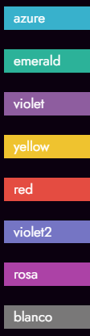

# web
## Langues
    HTML                --> 80%
    CSS3                --> 80%
    JavaScript          --> 80%
    PHP                 --> 80%
    Java                --> 65%
    MySQL               --> 75%
    Python              --> 65%
## CMS
    Moodle              --> 65%
    Wordpress           --> 70%
    Joomla              --> 60%
    Mediawiki           --> 65%
## Frameworks
    Bootstrap           --> 75%
    Laravel             --> 80%
    Angular js          --> 70%
    React               --> 65%
    Vue.js              --> 65%
    Tailwind CSS        --> 70%
    JQuery              --> 65%
# Techniques
## Adobe
    Photoshop           --> 80%
    Illustrator         --> 65%
    Premier pro         --> 70%
    After efects        --> 65%
    Audition            --> 65%
    Indesign            --> 70%
    Character animator  --> 65%
## Microsoft Office
    Word                --> 80%
    Excel               --> 75%
    PowerPoint          --> 75%
    Publisher           --> 75%
## Others
    Visual Studio code  --> 75%
    Netbeans            --> 65%
    Eclipse             --> 70%
    Arduino             --> 70%
    Figma               --> 70%
    Git                 --> 75%

