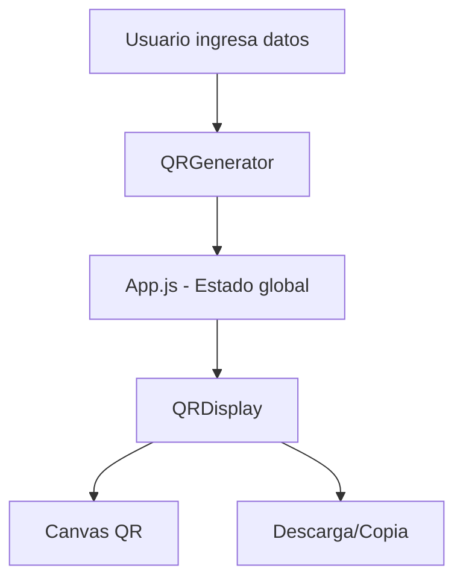
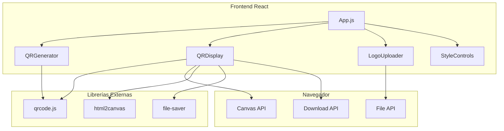
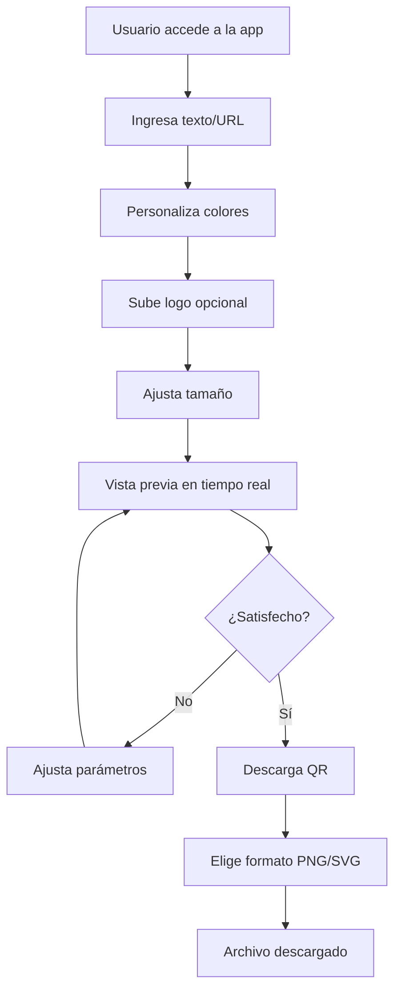
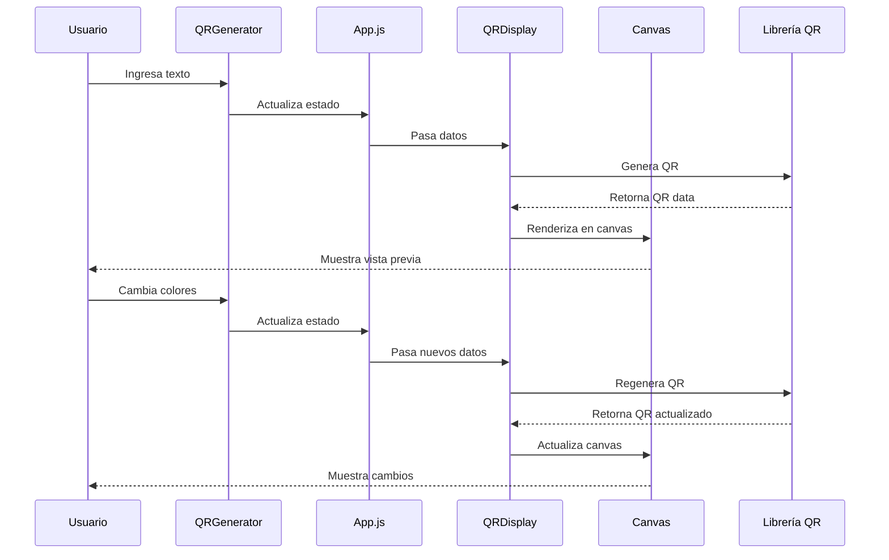
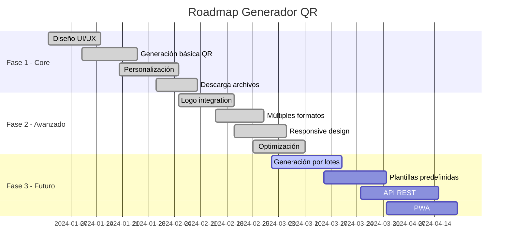

# 🎯 Generador de Códigos QR Moderno

<div align="center">


**Una aplicación web moderna y completamente personalizable para generar códigos QR profesionales**

[🚀 Demo en Vivo](#-demo) • [📖 Documentación](#-características) • [🛠️ Instalación](#-instalación) • [🎨 Capturas](#-capturas-de-pantalla)

</div>

---

## 📋 Tabla de Contenidos

- [🎯 Generador de Códigos QR Moderno](#-generador-de-códigos-qr-moderno)
  - [📋 Tabla de Contenidos](#-tabla-de-contenidos)
  - [🌟 Características](#-características)
    - [🎨 **Personalización Completa**](#-personalización-completa)
    - [🖼️ **Logo y Branding**](#️-logo-y-branding)
    - [🎭 **Estilos de Borde**](#-estilos-de-borde)
    - [📥 **Múltiples Formatos de Descarga**](#-múltiples-formatos-de-descarga)
    - [🎯 **Experiencia de Usuario**](#-experiencia-de-usuario)
  - [🎨 Capturas de Pantalla](#-capturas-de-pantalla)
    - [🖥️ Vista Principal](#️-vista-principal)
    - [📱 Vista Móvil](#-vista-móvil)
    - [🎨 Opciones Avanzadas](#-opciones-avanzadas)
  - [🚀 Demo](#-demo)
  - [🛠️ Instalación](#️-instalación)
    - [📋 Prerrequisitos](#-prerrequisitos)
    - [🔧 Instalación Paso a Paso](#-instalación-paso-a-paso)
    - [🏗️ Construcción para Producción](#️-construcción-para-producción)
  - [📱 Uso](#-uso)
    - [🎯 **Generación Básica**](#-generación-básica)
    - [🎨 **Personalización Avanzada**](#-personalización-avanzada)
    - [📥 **Descarga**](#-descarga)
  - [🏗️ Arquitectura del Proyecto](#️-arquitectura-del-proyecto)
    - [🧩 **Componentes Principales**](#-componentes-principales)
    - [🔄 **Flujo de Datos**](#-flujo-de-datos)
    - [🏗️ **Arquitectura del Sistema**](#️-arquitectura-del-sistema)
    - [👤 **Flujo de Usuario**](#-flujo-de-usuario)
    - [🔄 **Secuencia de Generación QR**](#-secuencia-de-generación-qr)
    - [🎨 **Sistema de Estilos**](#-sistema-de-estilos)
  - [🔧 Tecnologías Utilizadas](#-tecnologías-utilizadas)
    - [🎯 **Frontend**](#-frontend)
    - [📦 **Librerías**](#-librerías)
    - [🛠️ **Herramientas de Desarrollo**](#️-herramientas-de-desarrollo)
  - [📊 Estructura de Archivos](#-estructura-de-archivos)
  - [⚡ Funcionalidades Técnicas](#-funcionalidades-técnicas)
    - [🎯 **Generación de QR**](#-generación-de-qr)
    - [🖼️ **Procesamiento de Logo**](#️-procesamiento-de-logo)
    - [🎨 **Generación SVG**](#-generación-svg)
    - [🎭 **Sistema de Bordes**](#-sistema-de-bordes)
  - [🎯 Retos y Soluciones](#-retos-y-soluciones)
    - [🚧 **Retos Enfrentados**](#-retos-enfrentados)
      - [1. **Escaneabilidad con Logo**](#1-escaneabilidad-con-logo)
      - [2. **Generación SVG**](#2-generación-svg)
      - [3. **Rendimiento en Tiempo Real**](#3-rendimiento-en-tiempo-real)
      - [4. **Compatibilidad Cross-Browser**](#4-compatibilidad-cross-browser)
    - [💡 **Soluciones Implementadas**](#-soluciones-implementadas)
  - [🔮 Roadmap](#-roadmap)
    - [📅 **Timeline del Proyecto**](#-timeline-del-proyecto)
    - [🚀 **Próximas Características**](#-próximas-características)
    - [🛠️ **Mejoras Técnicas**](#️-mejoras-técnicas)
  - [🤝 Contribuir](#-contribuir)
    - [🔧 **Cómo Contribuir**](#-cómo-contribuir)
    - [📋 **Guías de Contribución**](#-guías-de-contribución)
  - [📄 Licencia](#-licencia)

---

## 🌟 Características

### 🎨 **Personalización Completa**
- ✅ **Múltiples tipos de contenido** (Texto, URL, Email, Teléfono, Ubicación)
- ✅ **Colores personalizables** (Código QR y fondo)
- ✅ **Tamaño ajustable** (100px - 500px)
- ✅ **Márgenes configurables** (0-10px)
- ✅ **Niveles de corrección** (L, M, Q, H)

### 🖼️ **Logo y Branding**
- ✅ **Subida de logos** en cualquier formato de imagen
- ✅ **Tamaño automático optimizado** para mantener escaneabilidad
- ✅ **Posicionamiento centrado** con fondo blanco
- ✅ **Ajuste automático del nivel de corrección** a Máximo (H)

### 🎭 **Estilos de Borde**
- ✅ **Sin borde** (por defecto)
- ✅ **Borde sólido** con color personalizable
- ✅ **Borde discontinuo** con grosor ajustable
- ✅ **Borde punteado** para un look más suave

### 📥 **Múltiples Formatos de Descarga**
- ✅ **PNG** - Máxima calidad, sin pérdida
- ✅ **JPG** - Archivos más pequeños, compresión optimizada
- ✅ **SVG** - Escalable infinitamente, editable
- ✅ **Copiar al portapapeles** para uso inmediato

### 🎯 **Experiencia de Usuario**
- ✅ **Interfaz moderna** con diseño glassmorphism
- ✅ **Vista previa en tiempo real** de todos los cambios
- ✅ **Completamente responsivo** para móviles y escritorio
- ✅ **Animaciones suaves** y transiciones elegantes
- ✅ **Información detallada** del código QR generado

---

## 🎨 Capturas de Pantalla

<div align="center">

### 🖥️ Vista Principal


### 📱 Vista Móvil


### 🎨 Opciones Avanzadas


</div>

---

## 🚀 Demo

**🌐 [Ver Demo en Vivo](https://soufian3raki.github.io/Generador-de-C-digos-QR-Moderno)**

O ejecuta localmente:
```bash
npm start
# Abre http://localhost:3000
```

---

## 🛠️ Instalación

### 📋 Prerrequisitos
- **Node.js** >= 14.0.0
- **npm** >= 6.0.0

### 🔧 Instalación Paso a Paso

1. **Clona el repositorio**
   ```bash
   git clone https://github.com/soufian3raki/Generador-de-C-digos-QR-Moderno.git
   cd Generador-de-C-digos-QR-Moderno
   ```

2. **Instala las dependencias**
   ```bash
   npm install
   ```

3. **Ejecuta en modo desarrollo**
   ```bash
   npm start
   ```

4. **Abre tu navegador**
   ```
   http://localhost:3000
   ```

### 🏗️ Construcción para Producción

```bash
# Construir para producción
npm run build

# Los archivos se generarán en la carpeta /build
```

---

## 📱 Uso

### 🎯 **Generación Básica**
1. **Selecciona el tipo** de contenido (Texto, URL, Email, etc.)
2. **Ingresa tu contenido** en el campo de texto
3. **Ve la vista previa** actualizarse automáticamente
4. **Descarga** en tu formato preferido

### 🎨 **Personalización Avanzada**
1. **Abre "Opciones avanzadas"**
2. **Ajusta el tamaño** (100px - 500px)
3. **Personaliza colores** con el selector
4. **Configura márgenes** y nivel de corrección
5. **Añade tu logo** subiendo una imagen
6. **Selecciona estilo de borde** si lo deseas

### 📥 **Descarga**
- **PNG**: Para máxima calidad
- **JPG**: Para archivos más pequeños
- **SVG**: Para escalabilidad y edición
- **Copiar**: Para uso inmediato

---

## 🏗️ Arquitectura del Proyecto

### 🧩 **Componentes Principales**

```
src/
├── components/
│   ├── Header.js          # 🎯 Encabezado con logo y título
│   ├── QRGenerator.js     # ⚙️ Panel de configuración
│   └── QRDisplay.js       # 👁️ Vista previa y descarga
├── App.js                 # 🏠 Componente principal
└── index.js              # 🚀 Punto de entrada
```

### 🔄 **Flujo de Datos**



### 🏗️ **Arquitectura del Sistema**



### 👤 **Flujo de Usuario**



### 🔄 **Secuencia de Generación QR**



### 🎨 **Sistema de Estilos**

- **CSS Modules** para componentes específicos
- **Variables CSS** para consistencia de colores
- **Flexbox/Grid** para layouts responsivos
- **Animaciones CSS** para transiciones suaves

---

## 🔧 Tecnologías Utilizadas

### 🎯 **Frontend**
- **React 18.2.0** - Framework principal
- **JavaScript ES6+** - Lenguaje de programación
- **CSS3** - Estilos y animaciones
- **Canvas API** - Renderizado de gráficos

### 📦 **Librerías**
- **qrcode** - Generación de códigos QR
- **lucide-react** - Iconos modernos
- **react-scripts** - Herramientas de desarrollo

### 🛠️ **Herramientas de Desarrollo**
- **Create React App** - Configuración inicial
- **ESLint** - Linting de código
- **Git** - Control de versiones

---

## 📊 Estructura de Archivos

```
qr-code-generator/
├── 📁 public/
│   ├── index.html          # 🏠 HTML principal
│   └── favicon.ico         # 🎯 Favicon
├── 📁 src/
│   ├── 📁 components/
│   │   ├── Header.js       # 🎯 Componente de encabezado
│   │   ├── Header.css      # 🎨 Estilos del encabezado
│   │   ├── QRGenerator.js  # ⚙️ Generador de QR
│   │   ├── QRGenerator.css # 🎨 Estilos del generador
│   │   ├── QRDisplay.js    # 👁️ Visualizador de QR
│   │   └── QRDisplay.css   # 🎨 Estilos del visualizador
│   ├── App.js              # 🏠 Componente principal
│   ├── App.css             # 🎨 Estilos principales
│   ├── index.js            # 🚀 Punto de entrada
│   └── index.css           # 🎨 Estilos globales
├── package.json            # 📦 Configuración del proyecto
├── .gitignore              # 🚫 Archivos ignorados
└── README.md               # 📖 Documentación
```

---

## ⚡ Funcionalidades Técnicas

### 🎯 **Generación de QR**
- **Algoritmo QRCode.js** para generación estándar
- **Canvas API** para renderizado de alta calidad
- **Detección automática** de tamaño de módulos
- **Optimización de rendimiento** con memoización

### 🖼️ **Procesamiento de Logo**
- **FileReader API** para carga de imágenes
- **Canvas compositing** para superposición
- **Ajuste automático** de nivel de corrección
- **Posicionamiento matemático** preciso

### 🎨 **Generación SVG**
- **Reconstrucción vectorial** del código QR
- **Elementos SVG nativos** para escalabilidad
- **Preservación de estilos** y colores
- **Optimización de archivos** para tamaño mínimo

### 🎭 **Sistema de Bordes**
- **CSS border styles** aplicados dinámicamente
- **Cálculo matemático** de grosor y estilo
- **Compatibilidad cross-browser** garantizada
- **Renderizado en tiempo real**

---

## 🎯 Retos y Soluciones

### 🚧 **Retos Enfrentados**

#### 1. **Escaneabilidad con Logo**
- **Problema**: Los logos pueden interferir con la lectura del QR
- **Solución**: Ajuste automático a nivel H de corrección y límite de tamaño del 25%

#### 2. **Generación SVG**
- **Problema**: Convertir canvas raster a formato vectorial
- **Solución**: Algoritmo de detección de módulos y reconstrucción SVG

#### 3. **Rendimiento en Tiempo Real**
- **Problema**: Regeneración constante del QR puede ser costosa
- **Solución**: Debouncing y memoización de componentes

#### 4. **Compatibilidad Cross-Browser**
- **Problema**: Diferentes implementaciones de Canvas API
- **Solución**: Polyfills y detección de características

### 💡 **Soluciones Implementadas**

- **🔄 Debouncing** para evitar regeneraciones excesivas
- **📊 Memoización** de componentes pesados
- **🎯 Detección inteligente** de módulos QR
- **⚡ Optimización de canvas** para mejor rendimiento
- **🎨 Fallbacks CSS** para navegadores antiguos

---

## 🔮 Roadmap

### 📅 **Timeline del Proyecto**



### 🚀 **Próximas Características**

- [ ] **🌍 Soporte multiidioma** (i18n)
- [ ] **📊 Analytics** de uso y estadísticas
- [ ] **☁️ Almacenamiento en la nube** de configuraciones
- [ ] **🎨 Más estilos de módulos** (círculos, formas personalizadas)
- [ ] **📱 PWA** (Progressive Web App)
- [ ] **🔗 API REST** para integración externa
- [ ] **📈 Dashboard** de administración
- [ ] **🎯 Templates** predefinidos

### 🛠️ **Mejoras Técnicas**

- [ ] **⚡ Web Workers** para procesamiento en background
- [ ] **📦 Code splitting** para mejor rendimiento
- [ ] **🧪 Tests unitarios** con Jest
- [ ] **📊 Métricas de rendimiento** con Lighthouse
- [ ] **🔒 HTTPS** y seguridad mejorada

---

## 🤝 Contribuir

¡Las contribuciones son bienvenidas! 🎉

### 🔧 **Cómo Contribuir**

1. **Fork** el proyecto
2. **Crea** una rama para tu feature (`git checkout -b feature/AmazingFeature`)
3. **Commit** tus cambios (`git commit -m 'Add some AmazingFeature'`)
4. **Push** a la rama (`git push origin feature/AmazingFeature`)
5. **Abre** un Pull Request

### 📋 **Guías de Contribución**

- **📝 Código**: Sigue las convenciones de ESLint
- **🎨 Estilos**: Mantén consistencia con el diseño existente
- **📖 Documentación**: Actualiza README si es necesario
- **🧪 Testing**: Añade tests para nuevas funcionalidades

---

## 📄 Licencia

Este proyecto está bajo la Licencia MIT. Ver el archivo [LICENSE](LICENSE) para más detalles.

```
MIT License

Copyright (c) 2024 QR Code Generator

Permission is hereby granted, free of charge, to any person obtaining a copy
of this software and associated documentation files (the "Software"), to deal
in the Software without restriction, including without limitation the rights
to use, copy, modify, merge, publish, distribute, sublicense, and/or sell
copies of the Software, and to permit persons to whom the Software is
furnished to do so, subject to the following conditions:

The above copyright notice and this permission notice shall be included in all
copies or substantial portions of the Software.

THE SOFTWARE IS PROVIDED "AS IS", WITHOUT WARRANTY OF ANY KIND, EXPRESS OR
IMPLIED, INCLUDING BUT NOT LIMITED TO THE WARRANTIES OF MERCHANTABILITY,
FITNESS FOR A PARTICULAR PURPOSE AND NONINFRINGEMENT. IN NO EVENT SHALL THE
AUTHORS OR COPYRIGHT HOLDERS BE LIABLE FOR ANY CLAIM, DAMAGES OR OTHER
LIABILITY, WHETHER IN AN ACTION OF CONTRACT, TORT OR OTHERWISE, ARISING FROM,
OUT OF OR IN CONNECTION WITH THE SOFTWARE OR THE USE OR OTHER DEALINGS IN THE
SOFTWARE.
```

---

<div align="center">

**⭐ Si te gusta este proyecto, ¡dale una estrella! ⭐**

[🐛 Reportar Bug](https://github.com/soufian3raki/Generador-de-C-digos-QR-Moderno/issues) • [💡 Solicitar Feature](https://github.com/soufian3raki/Generador-de-C-digos-QR-Moderno/issues) • [📖 Documentación](https://github.com/soufian3raki/Generador-de-C-digos-QR-Moderno/wiki)

---

*Desarrollado con ❤️ usando React y JavaScript*

</div>
