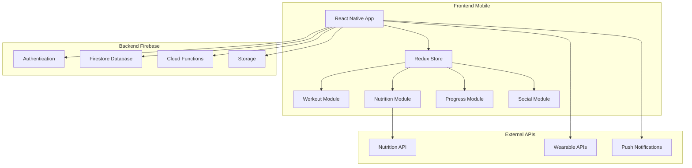
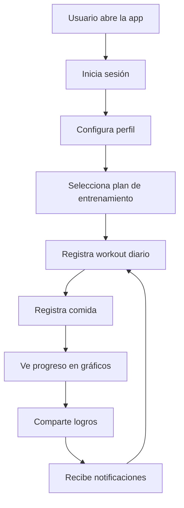
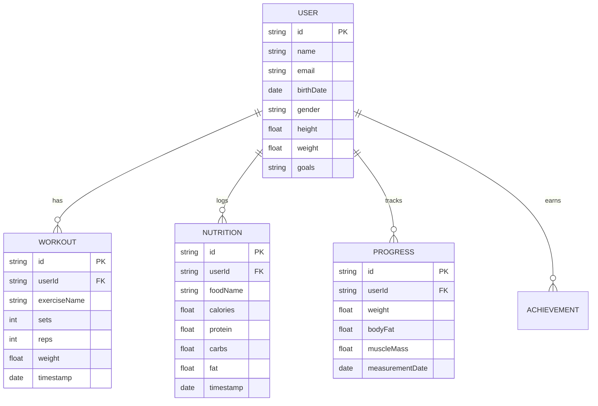

## 💪 **Fitness Tracker App**

Una aplicación móvil completa para el seguimiento de fitness con funcionalidades avanzadas de análisis y motivación.

### ✨ **Características Principales**

- **🏋️ Planes de Entrenamiento**: Rutinas personalizadas según objetivos
- **🍎 Registro de Nutrición**: Base de datos de alimentos con información nutricional
- **📊 Análisis de Progreso**: Gráficos detallados de evolución física
- **🏆 Sistema de Logros**: Gamificación para mantener la motivación
- **👥 Comunidad**: Red social para compartir logros y motivarse

### 🛠️ **Tecnologías Utilizadas**

- **Mobile**: React Native, Expo SDK
- **Backend**: Firebase (Auth, Firestore, Functions)
- **Estado**: Redux Toolkit, RTK Query
- **Gráficos**: React Native Chart Kit
- **Notificaciones**: Expo Notifications

### 🏗️ **Arquitectura de la Aplicación**

### 🔄 **Flujo de Usuario**

### 📊 **Sistema de Datos**

### 🎯 **Desafíos Técnicos**

- **Sincronización Offline**: Funcionalidad completa sin conexión
- **Rendimiento**: Optimización para dispositivos de gama baja
- **Datos Sensibles**: Protección de información de salud personal
- **Integración**: Conectores con wearables y apps de salud

### 📊 **Resultados**

- **📱 Descargas**: 10,000+ en App Store y Google Play
- **⭐ Rating**: 4.7/5 estrellas promedio
- **👥 Usuarios Activos**: 5,000+ mensuales
- **📈 Retención**: 65% de usuarios después de 30 días
